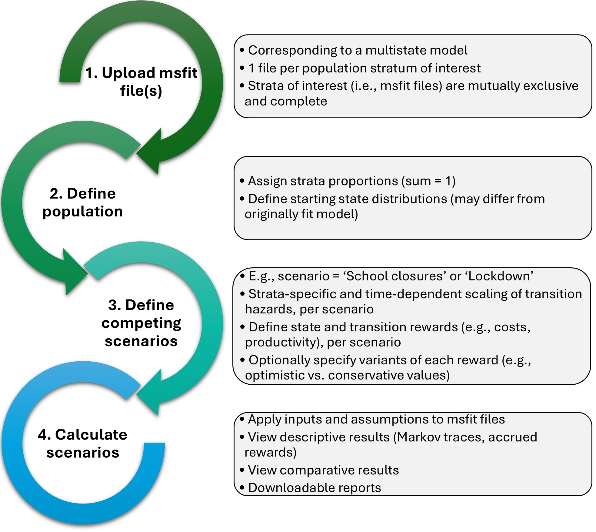

# FUSION Tool (R Shiny)

A Shiny app for **scenario analysis with continuous-time multi-state models (MSMs)** using `msfit` objects (from the `mstate` workflow) as input.

The app lets users:
- upload one or more `msfit` models (e.g., strata-specific models),
- define a target population and starting state distributions,
- apply **transition hazard scaling** under alternative scenarios,
- assign **state/transition rewards** (e.g., costs, QALYs),
- compare scenario outputs over time.

---

## What this tool is for

FUSION is a decision-support tool for comparing “what-if” scenarios based on an existing fitted MSM. It uses the uploaded `msfit` hazards as the baseline and recalculates outcomes under user-defined assumptions.

Typical use cases:
- policy scenario comparison
- resource/cost impact estimation
- reward-based summaries (e.g., QALYs, costs)
- subgroup/strata comparisons

---

## Project structure (required files)

Run the app from the repository root. `app.R` expects these files/folders to exist:

- `app.R`
- `functions/funs_jh.R`
- `app_components/UI_side/landing_panel.R`
- `app_components/UI_side/population_definition_panel.R`
- `app_components/UI_side/msfit_upload_panel.R`
- `app_components/UI_side/user_specifications_panel.R`
- `app_components/UI_side/outputs_panel.R`
- `html_appearance.R`
- `report_scenario.Rmd`

If any are missing, the app may fail to start.

---

## Installation and setup

### 1) Restore packages (recommended)

This project uses `renv` for reproducibility.

```r
install.packages("renv")   # if needed
renv::restore()
```

### 2) Run the app

From the project root in R/RStudio:

```r
source("app.R")
```

or

```r
shiny::runApp()
```

---

## Main package dependencies

Loaded in `app.R`:

- `shiny`
- `mstate`
- `ggplot2`, `ggpubr`, `plotly`
- `DT`, `reactable`
- `bslib`, `shinyjs`, `shinyWidgets`, `shinycssloaders`
- `shinyMatrix`, `shinyTree`, `shiny.fluent`
- `DiagrammeR`, `DiagrammeRsvg`
- `reshape2`, `data.table`

Also required for report export:
- `rmarkdown`

---

## Input requirements

### 1) `msfit` files (required)
Upload one or more `.rds` files containing objects of class **`msfit`**.

Rules:
- each file must be a valid `msfit` object
- if multiple files are uploaded, they must use the **same state/transition structure**
- multiple files are treated as **strata-specific models**

### 2) Population setup
The app will ask for:
- **total population size**
- **strata labels and weights** (if multiple `msfit` files)
- **starting state distribution** for each stratum

Validation rules:
- strata weights must sum to **1**
- each starting-state distribution must be non-negative and sum to **1**

---

## Workflow overview (UI guide, details under figure)

<p align="center">
  
</p>

*Figure: High-level workflow of the FUSION tool (upload inputs, define population/scenarios, and generate outputs).*

### 1) Upload
- Upload one or more `msfit` `.rds` files
- The app validates them and shows a state-transition diagram

### 2) Define population
- Set strata labels/weights
- Set starting-state distributions
- Confirm before continuing

### 3) Define scenarios
Two parts:

#### A. Transition scaling
You can define:
- up to **10 scenarios**
- up to **10 time windows** per scenario

For each time window, choose transitions and assign scaling factors (default = `1` = no change).

Notes:
- time windows should cover the full modeled period (from `0` to max time)
- the app aligns breakpoints to valid event times internally

#### B. Rewards
You can define up to **10 rewards**, including:
- **State rewards** (accrue while in a state)
- **Transition rewards** (accrue when moving between states)

Rewards can vary by:
- scenario
- stratum
- both

Advanced option:
- semicolon-separated values (e.g., `0.8;1.0;1.2`) create reward variants

### 4) Generate outputs
After calculation, the app provides:
- state occupancy over time
- reward summaries/comparisons
- transition counts
- final state occupancy
- downloadable HTML scenario reports

---

## Output files (generated during use)

The app writes intermediate/results files to the working directory, including:

- `msfit_list.rds`
- `inputs.rds`
- `state_trans_res.rds`
- `reward_results.rds`
- `transition_counts.rds`

Scenario reports are rendered from `report_scenario.Rmd` as HTML.

---

## Common errors and fixes

- **“Necessary msfit file(s) missing”**  
  Upload at least one `.rds` file.

- **“... is not of class 'msfit'”**  
  Make sure the file contains a true `msfit` object saved with `saveRDS()`.

- **“Cannot upload conceptually different models”**  
  Multiple uploaded `msfit` files must have the same states/transitions.

- **Strata weights error**  
  Weights must be numeric and sum to **1**.

- **Starting state distribution error**  
  Values must be non-negative and sum to **1** for each stratum.

- **Need to edit inputs after calculation**  
  Use **Restart session** (top bar) to reset and re-enter values.

---

## Methodological notes (important)

- FUSION is based on **continuous-time MSMs** and uses `msfit` hazards as baseline input.
- It supports **time-specific** and **stratum-specific** scenario assumptions.
- Results depend on:
  - the quality of the fitted MSM,
  - the selected population setup,
  - user-defined scenario and reward assumptions.

Limitations noted in the manuscript include:
- no formal uncertainty analysis in the current version
- no transmission feedback dynamics (i.e., not a mechanistic epidemic model)

---

## Citation

If you use this tool, please cite the associated manuscript:

ref pending

---

## Contributing

Please use GitHub Issues / Pull Requests for bug reports, feature requests, and contributions.
